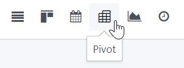

============
Pivot tables
============

Pivot tables are used to aggregate your records' data and breaking it down for analysis. They are
often available for reports found under the :guilabel:`Reporting` menu of most apps, but can be
found in other places. Click the :guilabel:`Pivot` view button located at the top right to access
them.

Using a pivot table involves, among others, selecting the relevant records and measures, and
grouping your data according to your needs.

.. _pivot/filters:

Filtering records
=================

To properly use a pivot table, you need to select the right records first. When you open a pivot
view, a default filter is set to select relevant records. You can modify it by clicking
:guilabel:`Filters` and selecting one or several **pre-configured filtering options**.

.. example::
   On the :guilabel:`Sales Analysis` report, only records which are at the sales order stage are
   selected by default. However, you could *also* include records at the quotation stage by
   selecting :guilabel:`Quotations`. Furthermore, you could *only* include records from a specific
   year, for example 2022, by selecting :menuselection:`Order Date --> 2022`.

   .. image:: pivot/filters.png
      :align: center
      :alt: Example of a re-configured filter on the Sales Analysis report

Custom filters
--------------

From there, you can also create a custom filter using a wide selection of fields present on the
model by clicking :guilabel:`Add Custom Filter`, selecting a field, an operator, a value, and
clicking :guilabel:`Apply`.

.. example::
   You could *only* include records from a single salesperson, for example Mitchell Admin, by
   selecting :guilabel:`Salesperson` as the field, :guilabel:`is equal to` as the operator, and
   typing `Mitchell Admin` as the value.

   .. image:: pivot/custom-filter.png
      :align: center
      :alt: Example of a custom filter on the Sales Analysis report

.. note::
   If the records should *only* match one of several conditions, click :guilabel:`Add a condition`
   before applying a custom filter. If the records should match *all* conditions, add new
   custom filters instead.

Search box
----------

You can also use the search box to quickly look for specific values and add them as a filter. Either
type the complete value you are searching for and select the desired field, or type a part of the
value, click the dropdown button (:guilabel:`⏵`) before the desired field, and select the exact
value you are looking for.

.. example::
   Instead of adding a custom filter to select records where Mitchell Admin is the salesperson, you
   could search for `Mitch`, click the dropdown button (:guilabel:`⏵`) next to :guilabel:`Search
   Salesperson for: Mitch` and select :guilabel:`Mitchell Admin`.

   .. image:: pivot/search-box.png
      :align: center
      :alt: Using the search box to find specific records on the Sales Analysis report

.. note::
   Using the search box is the equivalent of using the *contains* operator when adding a custom
   filter. If you enter a partial value and directly select the desired field, all records
   containing the characters you typed will be filtered.

Choosing measures
=================

Once the right records are filtered, you should choose what to measure. By default, a measure is
always selected. If you wish to edit it, click :guilabel:`Measures` and select one or multiple
fields. The different measures are then added as columns on the pivot table.

.. example::
   You could add the :guilabel:`Margin` and :guilabel:`Count` measures to the Sales Analysis report,
   which only displays the :guilabel:`Untaxed Amount` by default.

   .. image:: pivot/measures.png
      :align: center
      :alt: Selecting different measures on the Sales Analysis report

.. note::
   When you select a measure, Odoo aggregates the values recorded on that field for the filtered
   records. Only numerical fields (:ref:`integer <studio/fields/simple-fields/integer>`,
   :ref:`decimal <studio/fields/simple-fields/decimal>`, :ref:`monetary
   <studio/fields/simple-fields/monetary>`) can be measured. In addition, the :guilabel:`Count`
   option is used to count the total number of filtered records.

Grouping measures: dimensions
=============================

Grouping measures is useful to divide data in smaller subsets for analysis. A typical dimension is
*Date > Month*, which is used to analyze the evolution of a measure over the months. To add a
dimension, click the plus button (:guilabel:`➕`) next to :guilabel:`Total` at the level of rows or
columns and select one of the **pre-configured dimensions**. To remove a dimension, click the minus
button (:guilabel:`➖`).

.. example::
   You could divide the measures by the :guilabel:`Product Category` dimension on the previous
   example's rows.

   .. image:: pivot/single-dimension.png
      :align: center
      :alt: Adding a dimension on the Sales Analysis report

.. tip::
   Click on a measure's label to sort the values by ascending (⏶) or descending (⏷) order.

You can also create a **custom dimension** using a wide selection of fields present on the model by
clicking the plus button (:guilabel:`➕`), selecting a field, and clicking :guilabel:`Apply`.

Multiple dimensions
-------------------

Once you have added a dimension, you can add another one on the opposite axis or on a *single* of
the newly divided values.

.. example::
   You could further divide the measures by the :guilabel:`Salesperson` dimension on the previous
   example's columns and by the :guilabel:`Order Date > Month` dimension on the :guilabel:`All /
   Saleable / Office Furniture` product category.

   .. image:: pivot/multiple-dimensions.png
      :align: center
      :alt: Adding multiple dimensions on the Sales Analysis report

If you want to quickly add dimensions on the pivot table's rows, you can use the :guilabel:`Group
By` button below the search box. If you have more than one dimension, the new group will be applied
to *all* values of the previous dimension.

.. tip::
   - Click the flip axis button (:guilabel:`⇄`) to switches the rows and columns' dimensions.
   - Download a `.xlsx` version of the pivot table by clicking the download button (:guilabel:`⭳`).

Inserting in a spreadsheet
==========================

When you have obtained the desired pivot table, it is time to insert it in a spreadsheet. To do so,
click the :guilabel:`Insert in Spreadsheet` button. In the pop-up box, rename the pivot table if
needed, and either create a new spreadsheet by selecting :guilabel:`Blank spreadsheet` or insert it
in an existing spreadsheet by selecting it, then click :guilabel:`Confirm`.

.. note::
   By default, new spreadsheets are saved under the :guilabel:`Spreadsheet` workspace of the
   Documents app.

Data link
---------

Once inserted in a spreadsheet, a pivot table's measures are updated depending on the changes made
to your database. To see the new measures, go to :menuselection:`Top bar: Data --> Refresh all data`
or refresh your browser page.

.. note::
   If a new value is added to a dimension, it will *not* be added automatically to the pivot table.
   To update it, go to :menuselection:`Top bar: Data --> Re-insert pivot` and select the pivot table

You can edit manually your pivot by using the `=ODOO.PIVOT` formula.
